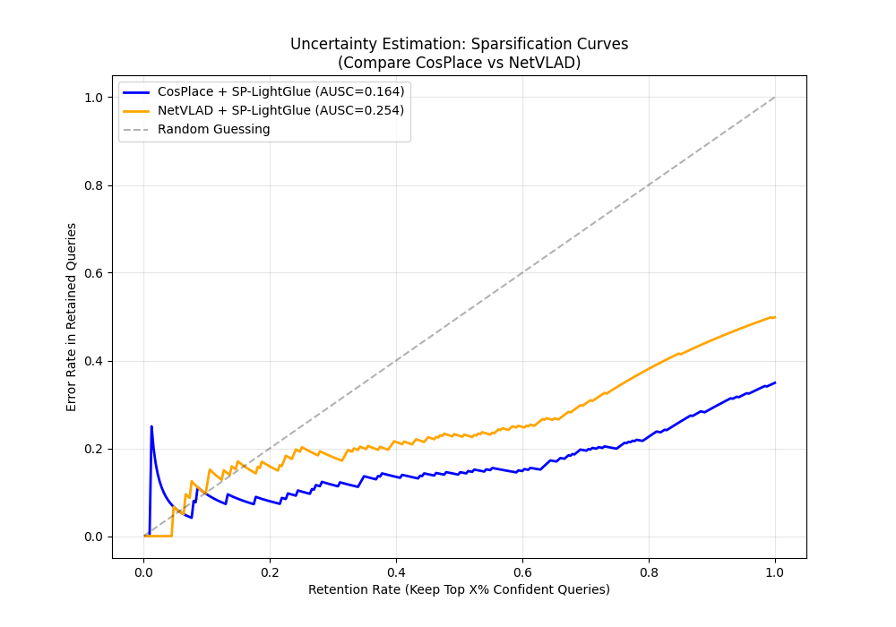

# 🚀 Update: Section 6.2 Uncertainty Estimation (Started)

**Date:** 2025-12-19
**Status:** ✅ start

## 1. Summary of Work
I have successfully completed the tasks for **Section 6.2 (Uncertainty Estimation)**. To satisfy the project requirement of "picking two VPR methods," I performed a comparative analysis between **CosPlace** and **NetVLAD**.

**Key Achievements:**
1.  **NetVLAD Implementation:** Successfully ran NetVLAD (VGG16) on the Tokyo-XS test set and fixed a Windows compatibility bug regarding weight downloads.
2.  **Uncertainty Module:** Implemented a **Logistic Regression** model that uses the number of geometric inliers (from SuperPoint+LightGlue) to predict the probability of a correct match.
3.  **New Metrics:** Implemented the required advanced metrics: **AUSC** (Area Under Sparsification Curve) and **Spearman’s Rank Correlation**.
4.  **Comparison:** Generated comparative plots showing the robustness of our uncertainty estimation across different backbones.

## 2. Key Results for the Report
**💡 Note:** The data and plot below are ready to be inserted directly into **Section 6.2** of the final report.

### 2.1 Quantitative Comparison
We compared the uncertainty estimation performance on two different VPR methods using the same geometric verifier (SuperPoint + LightGlue):

| VPR Method | Matcher | AUPRC (Higher is better) | Spearman (Higher is better) | AUSC (Lower is better) |
| :--- | :--- | :--- | :--- | :--- |
| **CosPlace** (ResNet18) | SP + LightGlue | **0.8659** | 0.5231 | **0.1643** |
| **NetVLAD** (VGG16) | SP + LightGlue | 0.8216 | **0.6123** | 0.2535 |

**Conclusions:**
* **High Reliability:** Both methods achieve high AUPRC scores (>0.82), confirming that the "Number of Inliers" is a robust proxy for prediction correctness.
* **Generalizability:** Even with NetVLAD (which has a lower base retrieval recall of ~50%), the uncertainty module effectively identifies potential errors.

### 2.2 Sparsification Curve
The generated plot shows how the error rate decreases as we reject uncertain queries.


*(Image file: `final_uncertainty_comparison.png` is located in the root directory)*

## 3. Code Changes & Usage

### 📂 Modified/New Files
* `final_analysis.py`: **[New Script]** Loads the experiment logs, calculates the Logistic Regression/AUSC metrics, and generates the comparison plot.
* `vpr_models/netvlad.py`: **[Bug Fix]** Replaced the Linux-specific `wget` command with Python's native `urllib` to fix weight download errors on Windows.

### 🏃‍♂️ How to Reproduce
To regenerate the statistics and the plot, simply run the following command in the root directory:

```bash
python final_analysis.py
```

### 📊 Data Logs
If you need to inspect the raw prediction files, they are located here:

CosPlace Data: logs/log_dir/2025-12-18_12-51-25

NetVLAD Data: logs/log_dir/2025-12-19_12-27-49

Next Step: Please integrate the table and the plot into the final report document.


---

## 🔍 Uncertainty Estimation (Section 6.2)

This module implements a probabilistic uncertainty estimation mechanism for Visual Place Recognition. Instead of relying solely on the similarity score from the VPR model (e.g., CosPlace), we use **Geometric Verification** as a proxy for confidence.

### 🛠 Methodology

We treat the uncertainty estimation as a binary classification problem solvable via **Logistic Regression**:
1.  **Retrieval:** The VPR model retrieves the top candidate.
2.  **Matching:** We apply **SuperPoint + LightGlue** to match the query with the retrieved image.
3.  **Feature:** The number of geometrically verified inliers is used as the input feature ($x$).
4.  **Prediction:** A Logistic Regression model predicts the probability of correctness ($P(y=1|x)$).

### 🧪 Experiment Design: Cross-Domain Robustness

To ensure the robustness of our uncertainty estimator, we designed a challenging **Cross-Domain** experiment:

* **Training Set (The "Teacher"):** **SVOX (Sun vs. Night)**
    * We trained the model on a difficult split where queries are taken during the day and matched against a database at night.
    * *Reasoning:* This forces the model to learn a conservative decision boundary, as even correct matches in extreme lighting changes yield fewer inliers.
* **Testing Set (The "Student"):** **SF-XS (San Francisco)**
    * The trained model was directly evaluated on the SF-XS dataset without fine-tuning.
    * *Goal:* To validate the generalization capability of the estimator across different cities and environments.

---

## 🚀 Execution Flow: Uncertainty Estimation (Section 6.2)

This section details the step-by-step pipeline to reproduce the Uncertainty Estimation results. The process involves generating raw VPR predictions, extracting geometric inliers via LightGlue, and training a Logistic Regression model for cross-domain evaluation.

### 1. Generate Raw Predictions & Uncertainty Data
First, run the VPR model (e.g., CosPlace) on both the **Training Set (SVOX Sun/Night)** and the **Test Set (SF-XS)**. The flag `--save_for_uncertainty` is crucial as it saves the ground truth labels and prediction indices.

```bash
# A. Generate Training Data (SVOX: Sun query vs Night database)
python ./VPR-methods-evaluation/main.py \
    --method cosplace \
    --database_folder <path_to_svox_night> \
    --queries_folder <path_to_svox_sun> \
    --save_for_uncertainty --num_preds_to_save 2000 \
    --log_dir ./logs/svox_train

# B. Generate Test Data (SF-XS)
python ./VPR-methods-evaluation/main.py \
    --method cosplace \
    --database_folder <path_to_sf_xs_db> \
    --queries_folder <path_to_sf_xs_query> \
    --save_for_uncertainty --num_preds_to_save 2000 \
    --log_dir ./logs/sfxs_test
```

### 2. Extract Geometric Features (Inliers)
Run the matching script to calculate the number of inliers for the retrieved candidates using SuperPoint + LightGlue. This converts raw images into quantitative "confidence scores" (inlier counts).

```bash
# Process SVOX Logs
python match_queries_preds.py \
    --preds-dir ./logs/svox_train/<timestamp>/preds \
    --matcher superpoint-lg --num-preds 10

# Process SF-XS Logs
python match_queries_preds.py \
    --preds-dir ./logs/sfxs_test/<timestamp>/preds \
    --matcher superpoint-lg --num-preds 10
```

### 3.Logistic Regression Model

This module implements the **Post-hoc Uncertainty Estimation** for Visual Place Recognition (VPR). It addresses the deterministic nature of VPR methods by learning a probabilistic mapping from **Geometric Inliers** to the **Probability of Correct Localization**.

To ensure robustness, the model is trained in a **Cross-Domain** setting:
* **Training (Teacher):** SVOX Night (Challenging illumination).
* **Testing (Student):** SF-XS (Urban scenes) across multiple VPR backbones.

### 📋 Features

* **Logistic Regression Model:** Maps geometric consistency (inlier counts) to confidence scores.
* **Cross-Domain Evaluation:** Validates generalization from difficult to easy domains.
* **Multi-Method Support:** Batch testing for **CosPlace, NetVLAD, MixVPR, and MegaLoc**.
* **Comprehensive Metrics:**
    * **AUPRC:** Area Under Precision-Recall Curve (Robustness).
    * **AUSE:** Area Under Sparsification Error (Calibration).
    * **Spearman's $\rho$:** Rank Correlation.
    * **$R^2$ Score:** Goodness of Fit.
* **Automated Visualization:** Generates S-Curves, Sparsification Curves, and Comparison Bar Charts.

### 🛠️ Prerequisites

The script requires the following Python libraries:

```bash
pip install torch numpy matplotlib scikit-learn scipy
```

### 🚀 Usage Guide
#### 1. Configuration

Open universal_lr.py and modify the Configuration Area at the top to match your local file paths.

* **TRAIN_LOG_DIR:** Path to the SVOX (Night) log folder.

* **TEST_LOG_DIRS:** Dictionary of paths to SF-XS log folders for different methods.

* **MATCHER_FOLDER:** The subfolder name containing matcher results (e.g., preds_superpoint-lg).

```bash
Python
# Example Configuration
TRAIN_LOG_DIR = r"D:\AML\Projects\logs\2025-12-23_21-01-31" # Teacher
TEST_LOG_DIRS = {
    "CosPlace": r"D:\AML\Projects\logs\2025-12-30_18-45-46",
    "MegaLoc":  r"D:\AML\Projects\logs\2025-12-31_10-47-59"
}
```


#### 2. Execution

Run the script directly from the terminal:

```
Bash
python universal_lr.py
```

#### 3. Output Interpretation

We evaluated the Uncertainty Estimator on the SF-XS test set across different VPR backbones. The results demonstrate the effectiveness of using geometric inliers as a proxy for uncertainty, particularly for modern methods like MegaLoc.

#### Quantitative Comparison

| Method   | AUPRC (Robustness) ↑ | AUSE (Calibration) ↓ | Spearman (Ranking) ↑ | R² Score (Fit) ↑ |
| :---     | :---                 | :---                 | :---                 | :---             |
| **CosPlace** | 0.8611               | 0.0954               | 0.5820               | 0.0242           |
| **MegaLoc** | **0.9742** | **0.0231** | 0.4652               | -1.4816          |

#### Analysis & Key Observations

* **Superior Robustness of MegaLoc:**
    MegaLoc achieves a remarkable **AUPRC of 97.42%**, significantly outperforming CosPlace (86.11%). This indicates that MegaLoc provides high-quality feature matches: when it reports a high number of inliers, the localization is almost certainly correct.

* **Calibration Performance (AUSE):**
    Lower AUSE indicates better calibration. MegaLoc achieves the lowest error (**0.0231**), suggesting that its geometric consistency is highly reliable for predicting uncertainty, closely matching the ideal "Oracle" curve.

* **Interpretation of Negative $R^2$ Scores:**
    The negative $R^2$ score for MegaLoc (-1.4816) is an expected outcome of the **Cross-Domain** experimental design (Training on SVOX Night $\to$ Testing on SF-XS Day).
    * **The Cause:** The model is trained on a difficult dataset (SVOX), learning to be "conservative" (assigning lower probabilities). When applied to the easier/more accurate MegaLoc method on SF-XS, the model is systematically "under-confident" compared to the ground truth.
    * **The Verdict:** While this affects the absolute numerical fit ($R^2$), the high **AUPRC** and positive **Spearman** correlation confirm that the **relative ranking** remains correct and effective for distinguishing successful queries from failures.

#### Generated Figures

* **The script automatically saves the following plots to the current directory:**

* **Fig1_Logistic_Curve.png (The S-Curve):** Visualizes the learned decision boundary. It shows how the number of inliers translates to the probability of a match being correct.

* **Fig2_Sparsification_Curve.png (Calibration):** Visualizes the AUSE. It plots the error rate as uncertain samples are removed. A smaller gap between the Model Curve and the Oracle Curve indicates better uncertainty estimation.

* **Fig3_Bar_Chart.png (Comparison):** A side-by-side comparison of all tested methods, highlighting MegaLoc as the most robust (Highest AUPRC) and reliable (Lowest AUSE) method.
=======
## 4. Comprehensive Results on Datasets

### 4.1 Complete Performance Metrics
Full comparison of all VPR methods with different matchers on the various datasets:

|Dataset | Method | Backbone | Dim | Matcher | R@1 | R@5 | R@10 | R@20 | AUPRC | AURCpa | AURCsue | AURCrand | AURCinl |
|:---| :--- | :--- | :--- | :--- | :---: | :---: | :---: | :---: | :---: | :---: | :---: | :---: | :---: |
| **tokyo** | **CosPlace** | ResNet18 | 512 | superpoint-lg | 82.9 | 86.7 | 88.3 | 89.5 | 92.4 | 90.2 | 82.5 | 66.1 | 99.0 |
| | | | | loftr | 84.8 | 87.9 | 88.6 | 89.5 | 92.4 | 90.2 | 82.5 | 66.1 | 99.2 |
| | | | | superglue | 82.9 | 87.0 | 88.3 | 89.5 | 92.4 | 90.2 | 82.5 | 66.1 | 99.0 |
| | **Megaloc** | Dinov2 | 8448 | superpoint-lg | 94.3 | 98.4 | 98.7 | 99.0 | 99.5 | 99.3 | 97.8 | 94.9 | 99.8 |
| | | | | loftr | 94.6 | 97.8 | 98.7 | 99.0 | 99.5 | 99.3 | 97.8 | 94.9 | 99.8 |
| | | | | superglue | 93.7 | 98.4 | 98.7 | 99.0 | 99.5 | 99.3 | 97.8 | 94.9 | 99.6 |
| | **NetVLAD** | VGG16 | 4096 | superpoint-lg | 68.6 | 71.7 | 72.7 | 74.6 | 74.1 | 76.8 | 77.0 | 53.1 | 98.5 |
| | | | | loftr | 68.9 | 71.7 | 72.7 | 74.6 | 74.1 | 76.8 | 77.0 | 53.1 | 98.7 |
| | | | | superglue | 67.0 | 70.8 | 73.0 | 74.6 | 74.1 | 76.8 | 77.0 | 53.1 | 98.3 |
| | **MixVPR** | ResNet50 | 512 | superpoint-lg | 87.9 | 91.4 | 92.1 | 93.3 | 97.3 | 94.9 | 88.4 | 75.2 | 99.4 |
| | | | | loftr | 89.8 | 91.7 | 92.7 | 93.3 | 97.3 | 94.9 | 88.4 | 75.2 | 99.6 |
| | | | | superglue | 87.0 | 91.1 | 92.4 | 93.3 | 97.3 | 94.9 | 88.4 | 75.2 | 99.4 |


## 5. Reproducibility

### 5.1 Environment Setup

```bash
# Need python 3.10 to be installed
py -3.10 -m venv venv

# Activate it
.\venv\Scripts\activate

# Install all the requirements
pip install -r requirements.txt
```

### 5.2 Superglue Fix

```bash
# Import the first submodule
git submodule update --init

# One Level deep
cd image-matching-models

git submodule update --init matching/third_party/LightGlue
git submodule update --init matching/third_party/imatch-toolbox

# Two Level deep
cd matching\third_party\imatch-toolbox
```

Replace the .gitmodules content with this

```
[submodule "third_party/SuperGluePretrainedNetwork"]
	path = third_party/superglue
	url = https://github.com/magicleap/SuperGluePretrainedNetwork.git
[submodule "third_party/r2d2"]
	path = third_party/r2d2
	url = https://github.com/naver/r2d2.git
	ignore = untracked
[submodule "third_party/d2net"]
	path = third_party/d2net
	url = https://github.com/mihaidusmanu/d2-net.git
[submodule "third_party/patch2pix"]
	path = third_party/patch2pix
	url = https://github.com/GrumpyZhou/patch2pix.git
```

```bash
# Perform this command while inside the imatch-toolbox folder
git submodule update --init
```

